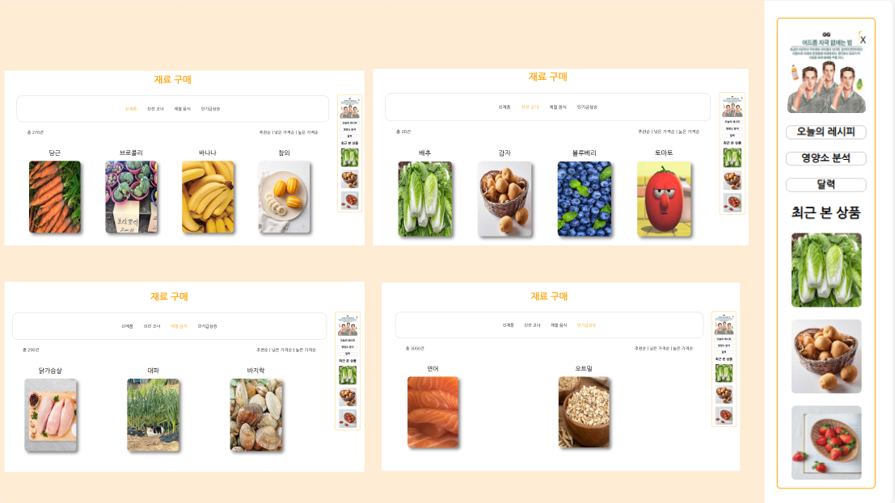

# 💪Healthy-Me

### 정리된 링크
* 피그마 : https://www.figma.com/slides/W9ppk5sgnSBxaEytB2OdlN/Untitled--Copy-?node-id=1-246&t=V0vn1aut9TBMyHhO-1

### 페이지 구분
----------------------
| 조원 | 전정현 | 윤성환 | 윤수빈 | 김종호 |
|--------|--------|--------|--------|--------|
| 맡은 페이지 | Main | 달력, 설문조사 | 구매 | 달력 |

### 개요
-----
* 사용자 맞춤형 영양 성분 추천
사용자가 부족한 영양소를 쉽게 파악하고, 그에 맞는 음식을 추천받을 수 있는 시스템 구축.
* 건강한 식단 선택 유도
사용자가 건강한 식단을 할 수 있게 우선적으로 영양성분을 분석해주고  지속적으로 건강을 챙길 수 있도록 돕는 프로그램 제공.
* 시간 절약과 식단 관리 지원
사용자들이 더 효율적으로 시간을 절약하고, 자신에게 맞는 식단을 선택할 수 있도록 지원하는 유용한 플랫폼을 구축.

### 개발 환경
---------------
* Front : HTML, CSS, JavaScript (with jQuery)

### 주요 성과 및 기여
------
1. 회원가입 및 로그인 화면 구현
2. 헤더와 푸터를 분리 후 각 페이지에 적용할 수 있게 구현
3. 옆 사이드 바 구현
   * 화면을 내렸을 때 따라오는 기능 구현
4. 재료 구매 페이지 구현
   * 각 카테고리를 선택시 각 부분에 맞는 내용으로 변경하는 기능 구현

### 완료된 페이지
----------
* 작업 전 화면 구상

 
* 작업 후 완성된 화면

 

### 작업 후 문제점
-------
1. 재료구매 페이지에 들어 왔을 때 빈 화면

2. 재료 이미지들이 다소 큰점

### 문제점 개선 후 
------

### 최종 느낀점
-------
이번 프로젝트에서는 처음으로 화면 기획부터 요구사항 정의서, 요구사항 분석, 유스케이스, 와이어프레임, 프로토타입까지 전 과정을 체계적으로 구성한 후 작업을 시작해보았습니다. 이렇게 틀을 먼저 잡고 프로젝트에 들어가니, 이전처럼 계획 없이 바로 작업을 시작했을 때보다 훨씬 유연하게 진행할 수 있었고, 전체적인 흐름도 더 명확하게 보였습니다.

프론트엔드 구현 단계에서는 HTML, CSS, JavaScript뿐 아니라, 구글링과 공부를 통해 익힌 jQuery도 적용해보았습니다. 덕분에 구현하고자 했던 기능들을 더 정확하게 표현할 수 있었고, 새로운 기술을 적용해보며 실력을 확장할 수 있는 좋은 기회가 되었습니다. 물론 처음 적용하는 기술이다 보니 소소한 문제들도 있었지만, 그 과정에서 다시 한 번 학습의 중요성을 느낄 수 있었습니다.

이번 프로젝트는 프론트엔드 구현에서 마무리되었지만, 직접 작업을 하다 보니 백엔드 개발에 대한 욕심도 생겼습니다. 기회가 된다면 혼자서라도 백엔드까지 구현해보고 싶고, 그 결과물도 이곳에 공유할 계획입니다.

이번 경험을 통해 체계적인 준비의 중요성과 지속적인 학습의 필요성을 다시금 느꼈으며, 다음 프로젝트는 더 나은 방향으로 성장할 수 있을 것이라는 확신이 들었습니다.
